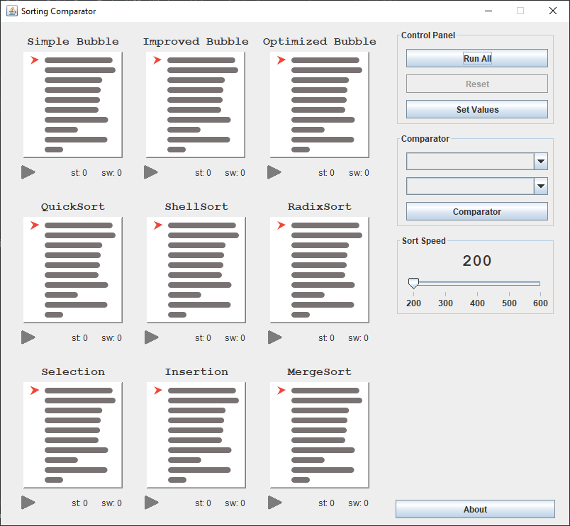

# Sorting Comparator
Animación y comparación de los principales métodos de ordenamiento interno
* Burbuja Simple
* Burbuja Mejorada
* Burbuja Optimizada
* QuickSort
* ShellSort
* RadixSort
* Selección
* Inserción
* MergeSort

  

